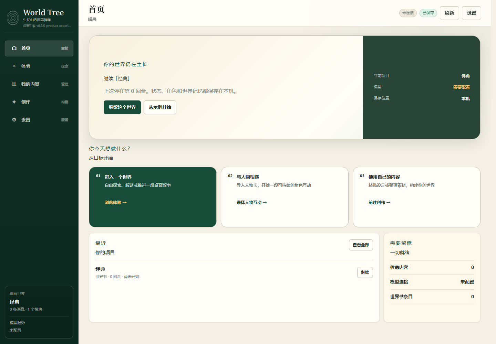

# World Tree

> 本地优先的 AI 文字冒险大厅：导入角色、世界书、案件或灵感，进入一个可以保存、继续、审核和导出的互动世界。
>
> Package version: v0.5.0-product-experience-rebuild.0
>
> 快速开始：[docs/USER_QUICKSTART.md](docs/USER_QUICKSTART.md) | 文档索引：[docs/INDEX.md](docs/INDEX.md) | 状态术语：[docs/STATUS_TERMINOLOGY.md](docs/STATUS_TERMINOLOGY.md)

World Tree 让用户进入角色、世界、案件、局势和故事现场，进行持续的互动、探索、推理、扮演和体验。它也提供创作能力，但创作不是终点：创作角色，是为了互动；创作世界书，是为了探索；创作案件，是为了推理；创作项目包，是为了让体验能保存、继续和扩展。

```text
创作是准备世界。
体验是进入世界。
World Tree 的重点，是让用户真的能进去玩。
```

---

## 第一眼



v0.5 使用“首页 / 体验 / 我的内容 / 创作 / 设置”五个稳定入口。上图是自动化浏览器在 1440px 视口捕获的真实应用页面；[设计概念板](design/v0.5/living-archive-product-concept.png) 与 [体验工作区证据](docs/images/v0.5-experience-workspace.png) 也随仓库保留。真人试玩和 60 秒录屏仍为 `HUMAN_VALIDATION_REQUIRED`，因此不标记人签 `PLAYABLE`。

## 三支柱

| 支柱 | 你得到什么 |
| --- | --- |
| 持续冒险 | 每个世界有历史、状态、提案和可继续的上下文，不只是一次性聊天 |
| 受控创作 | 炼金台、导入器和审核队列把素材变成候选内容，关键变化先确认再写入 |
| 本地优先 | 项目、角色、世界书、运行记录和导出包都以本机文件为核心，便于迁移和审计 |

## 60 秒上手

```bash
git clone https://github.com/HatayaMisuzu/world-tree.git
cd world-tree
npm install
npm start
```

打开 `http://127.0.0.1:3000`，进入首页：

1. 点击“从示例开始”，或在“体验”中选择一种玩法。
2. 在“设置 → 模型连接”中填写 OpenAI-compatible 服务并测试连接。
3. 回到首页，点击“继续这个世界”。
4. 输入一个动作或选择开场建议。
5. 看到“待确认”时先审阅，再决定是否写入正式世界状态。

## 模型服务

World Tree 当前优先支持 OpenAI-compatible 服务，并提供 provider adapter 基础：OpenAI-compatible、Anthropic、Google、mock。真实首玩 smoke 需要 `WT_SMOKE_BASE_URL`、`WT_SMOKE_MODEL`、`WT_SMOKE_KEY` 或 workflow secrets；没有凭据时只能记录 `BLOCKED_BY_CREDENTIALS`，不能声称真实 LLM PASS。

## 和 SillyTavern 的关系

World Tree 可以导入 SillyTavern 角色卡和世界书，把它们变成本地可审核、可继续的项目素材。它不是 ST 前端替代品，也不承诺直接复刻 ST 全部字段；不支持字段会以 `ignoredUnsupportedFields` 显示，避免静默吞内容。

## Roadmap

| 阶段 | 重点 | 状态 |
| --- | --- | --- |
| First playable candidate | 示例世界、首玩 smoke、产品大厅、基础导入导出 | 当前工程已建立候选路径 |
| Playable evidence | Tier-1 真实 LLM、真人试玩、60 秒录屏、HUMAN_SIGNED | 需要凭据和人工验收 |
| Content ecosystem | `.wtpack`、官方内容管线、ST 导入质量、第三方内容包 | 基础规格已建立 |
| Long-play quality | Tier-2 叙事评测、录制回放、长期记忆/分支稳定性 | 评测 harness 已建立 |

## 工程状态与真相源

当前版本：`0.5.0-product-experience-rebuild.0`。维护者和 agent 的当前 truth source 在 [docs/PROJECT_TRUTH_SOURCE.md](docs/PROJECT_TRUTH_SOURCE.md)，配套状态文件是 [docs/CURRENT_PROJECT_STATE.md](docs/CURRENT_PROJECT_STATE.md) 和 [docs/V2_ENGINEERING_CLOSURE_STATUS.md](docs/V2_ENGINEERING_CLOSURE_STATUS.md)。

Selected V2 service slices have engineering foundation evidence, but full product closure is not complete. Strategy Sim V2 engineering foundation is complete; Strategy Sim V2 product closure is not complete. Worldbook V2 engineering foundation is complete; Worldbook V2 product closure is not complete.

V2 Entry Closure baseline covers Tabletop V2, Detective V2, Character V2, and 单人剧本杀 V2 service/engineering slices; it does not mean full product-wide playable closure.

## 你可以体验什么？

```text
World Tree
│
├─ 和角色对话、建立关系、体验人物性格
├─ 进入世界书，在大世界中探索事件和变化
├─ 进行单人桌面叙事，像跑团一样推进剧情
├─ 调查谜题，收集线索，形成假说
├─ 推演阵营和局势，看世界如何回应你的选择
├─ 玩单人剧本杀，审讯、推理、复盘真相
└─ 使用炼金台，把灵感变成可继续游玩的内容
```

---

## 快速体验

### 1. 准备环境

你需要先安装：

- Node.js
- npm
- Git，可选，用来拉取仓库

### 2. 获取项目

```bash
git clone https://github.com/HatayaMisuzu/world-tree.git
cd world-tree
```

如果你是下载 ZIP，也可以直接解压后进入项目目录。

### 3. 安装依赖

```bash
npm install
```

### 4. 启动

```bash
npm start
```

启动后，在浏览器打开：

```text
http://127.0.0.1:3000
```

如果终端显示了不同端口，请以终端输出为准。

---

## 第一次怎么玩？

推荐按这个顺序体验：

```text
1. 打开 World Tree
2. 选择一个入口
3. 新建或加载项目
4. 输入你的行动、问题或设定
5. 让 AI 推进体验
6. 保存项目，下次继续
```

当前版本更接近 V2 entry closure / productization baseline：部分入口已有工程或服务闭环，但全面产品闭环尚未完成。没有内置内容包时，部分入口需要用户自行提供素材。

Creation Forge / 炼金台 G1 的工程闭环已经接入：它可以生成创作地图、内容预览、本地文件夹草案，并在用户选择目标且确认后交付。当前 productization closure evidence 已记录用户自带内容 Flow A/Flow B PASS，以及空白结构模板 PASS。

当前 Productization Closure 报告见 `docs/reports/productization-closure-report.md`，状态仍为 PARTIAL by product decision：User-Created Content Product Closure、空白模板基础设施、选定 V2 用户自带/结构化内容产品闭环、以及内置首玩示例 `demo-world-cloud-steam-city`（云上蒸汽城）已记录；角色卡示例包和剧本杀示例包仍为 `DEFERRED_AFTER_FIRST_PLAY_CANDIDATE`，不声明 `v1.0.0` ready。真实 LLM smoke 若无凭据配置则记录为 `BLOCKED_BY_CREDENTIALS`，不用本地 fallback 或本地 prompt 合同审计冒充真实 LLM。

Global product closure remains incomplete: the selected V2 API/service loops do not mean browser/UI entry closure or full product-wide product closure.

如果你不知道从哪里开始，可以这样选：

| 你想做什么 | 推荐入口 |
| --- | --- |
| 想快速生成一个可玩的项目 | 快速设定 |
| 想和一个角色互动 | 人物卡 |
| 想进入一个世界探索 | 世界书大世界 |
| 想体验单人跑团 | 桌面叙事 |
| 想玩调查和解谜 | 解谜调查 |
| 想推演势力和局势 | 策略模拟 |
| 想玩单人剧本杀 | 单人剧本杀 |
| 想把灵感炼成项目素材 | 炼金台 |

---

## 功能入口

| 入口 | 当前状态 | 你能体验到什么 |
| --- | --- | --- |
| 快速设定 | Usable thin loop | 把一句灵感、一段设定或一个世界观快速变成可继续体验的项目草稿 |
| 人物卡 | Usable / V2 engineering slice | 创建并体验角色；部分 Character V2 长期候选机制已接入 |
| 世界书大世界 | Usable / Worldbook V2 selected product loop PASS | 进入世界，基于世界书进行探索；Worldbook V2 用户自带/结构化 API 产品闭环已验证，完整编辑器 UX 仍未完成 |
| 桌面叙事 | Experimental / Tabletop V2 service closure | 有 Tabletop V2 服务闭环和轻量跑团切片；不是完整 DND |
| 解谜调查 | Experimental / Detective V2 service closure | 有线索、假说、隐藏真相边界和 Detective V2 服务能力；不是完整推理引擎 |
| 策略模拟 | Minimal slice / Strategy Sim V2 selected product loop PASS | 有资源与决策薄切片；Strategy Sim V2 用户自带 spec 的 validate/seal/start/turn/save/load/export 已验证，不是完整 4X |
| 单人剧本杀 | Experimental / ScriptKill V2 service closure | 有 Single Player ScriptKill V2 服务闭环；当前仍需要用户提供或后续注册内容包 |
| 炼金台 | Producer tool | 把灵感整理成候选内容和审核项；不是普通游玩入口 |

说明：

- World Tree 对外保持 8 个 canonical 产品入口；`tabletop-v2`、`detective-v2`、`character-v2`、`single-player-scriptkill-v2` 是运行时服务切片或别名，不是第九个入口。
- `ScriptKill` / `single-player-scriptkill-v2` 归属于"单人剧本杀"；`detective-v2` 归属于"解谜调查"；`tabletop-v2` 归属于"桌面叙事"。
- `world-rpg` 是项目里的历史内部名字，现在代表"世界书大世界"，不是传统刷级 RPG。
- `creation-forge` 是"炼金台"，主要负责生产可体验内容，不是普通游玩入口。

---

## 项目特点

### 多种体验入口

World Tree 不是只有一种聊天玩法，而是把不同体验拆成不同入口：

```text
角色互动
世界探索
桌面叙事
解谜调查
策略推演
剧本杀推理
内容炼成
```

每个入口都有自己的用途，不会混成一团。

### 本地优先

项目默认在本机运行，适合个人创作、游玩和测试。你的项目文件保存在本地目录中，方便备份、迁移和继续开发。

### 可以继续的体验

World Tree 的目标不是一次性生成一段文本，而是让体验能继续：

```text
这次玩到哪里
发生了什么
哪些设定已经成立
哪些变化等待确认
下次从哪里继续
```

这些都会进入项目存档。

### 重要改动先审核

AI 不会随便把关键设定直接写死。重要变化会先进入"提案"，你确认后才会变成正式内容。

```text
AI 提议变化
   │
   ▼
待审核提案
   │
   ├─ 批准 → 写入正式设定
   └─ 拒绝 → 不影响正式设定
```

### 隐藏真相保护

解谜、剧本杀、策略模拟等模式需要隐藏信息。World Tree 会尽量把真相、答案、幕后计划等内容和玩家可见信息分开，减少剧透和串线。

### 创作服务于体验

World Tree 有创作能力，但它不是单纯的素材管理器。它更像一台体验生成器：

```text
生成角色 → 为了互动
生成世界 → 为了探索
生成案件 → 为了推理
生成阵营 → 为了推演
生成项目 → 为了继续游玩
```

---

## 项目会保存什么？

一个 World Tree 项目大致包含：

```text
project/
│
├─ world.json
│   └─ 项目基础信息
│
├─ shared/
│   └─ 正式内容：角色、世界书、场景、关系、时间线等
│
└─ runtime/
    ├─ chat.jsonl
    │   └─ 对话和游玩记录
    │
    ├─ cache/
    │   └─ 运行缓存
    │
    └─ *-proposals.jsonl
        └─ 等待审核的改动
```

简单理解：

```text
shared   = 正式设定
runtime  = 体验过程
cache    = 临时缓存
proposal = 等你批准的变化
```

---

## 项目结构

```text
world-tree/
│
├─ README.md
├─ README.en.md
├─ CHANGELOG.md
├─ AI-GUIDE.md
│
├─ world-tree-console.html
│   └─ 网页界面
├─ world-tree-console.css
│   └─ 样式
├─ world-tree-console.js
│   └─ 前端交互
│
├─ server.js
│   └─ 本地服务入口
│
├─ src/
│   ├─ server/
│   │   ├─ 项目读写
│   │   ├─ 文件安全
│   │   ├─ 项目导入导出
│   │   └─ 本地接口服务
│   │
│   └─ core/
│       ├─ system/
│       │   ├─ 模式入口
│       │   ├─ 运行调度
│       │   ├─ 存档写入
│       │   ├─ 提案审核
│       │   └─ 隐藏信息隔离
│       │
│       ├─ prompts/
│       │   └─ 各模式给 AI 的提示规则
│       │
│       ├─ modes/
│       │   └─ 模式登记、项目初始化、运行基础
│       │
│       ├─ character/
│       │   └─ 人物卡体验
│       │
│       ├─ worldbook/
│       │   └─ 世界书基础
│       │
│       ├─ grand-world/
│       │   └─ 世界书大世界
│       │
│       ├─ tabletop/
│       │   └─ 桌面叙事
│       │
│       ├─ mystery-puzzle/
│       │   └─ 解谜调查
│       │
│       ├─ strategy-sim/
│       │   └─ 策略模拟
│       │
│       ├─ murder-mystery/
│       │   └─ 单人剧本杀
│       │
│       ├─ creation-forge/
│       │   └─ 炼金台
│       │
│       ├─ engine/
│       │   └─ 旧兼容引擎，不建议随意删除
│       │
│       └─ data/
│           └─ 旧数据和兼容资产
│
├─ docs/
│   ├─ INDEX.md
│   ├─ PROJECT_OVERVIEW.md
│   ├─ FEATURES.md
│   ├─ ARCHITECTURE_V1.md
│   ├─ API_REFERENCE.md
│   ├─ SAVE_SYSTEM_AND_WORLD_PACK.md
│   ├─ DOCUMENTATION_STATUS.md
│   ├─ LEGACY_REDUNDANCY_AUDIT.md
│   └─ LEGACY_COMPATIBILITY_AND_UPGRADE_PLAN.md
│
├─ scripts/
│   └─ 检查、测试和审计脚本
│
└─ tests/
    ├─ unit/
    └─ integration/
```

---

## 常用命令

| 命令 | 作用 |
| --- | --- |
| `npm start` | 启动本地体验 |
| `npm run test:unit` | 运行单元测试 |
| `npm run test:integration` | 运行集成测试 |
| `npm run docs:check` | 检查文档状态 |
| `npm run legacy:check` | 检查旧文件分类说明 |
| `npm run preflight` | 提交前综合检查 |

普通用户只需要：

```bash
npm install
npm start
```

开发者提交前建议：

```bash
npm run preflight
npm run legacy:check
```

---

## 更多文档

| 文档 | 内容 |
| --- | --- |
| `docs/PROJECT_TRUTH_SOURCE.md` | 当前真相源总入口 |
| `docs/CURRENT_PROJECT_STATE.md` | 当前项目状态 |
| `docs/V2_ENGINEERING_CLOSURE_STATUS.md` | V2 工程闭环状态 |
| `docs/V2_ENTRY_COMPLETION_STATUS.md` | V2 入口完成状态 |
| `docs/STATUS_TERMINOLOGY.md` | 状态术语规范 |
| `docs/AGENT_STATUS_HANDOFF.md` | Agent 快速交接 |
| `docs/INDEX.md` | 文档总入口 |
| `docs/PROJECT_OVERVIEW.md` | 项目总览 |
| `docs/FEATURES.md` | 功能说明 |
| `docs/ARCHITECTURE_V1.md` | 当前结构 |
| `docs/API_REFERENCE.md` | 接口说明 |
| `docs/SAVE_SYSTEM_AND_WORLD_PACK.md` | 存档与导入导出 |
| `docs/DOCUMENTATION_STATUS.md` | 文档状态 |
| `AI-GUIDE.md` | 给 AI Agent 的操作说明 |

README 只介绍如何理解和开始体验项目。维护策略、兼容层、历史文档和测试细节请看 `docs/` 目录。

## 给维护者和 AI Agent

本项目有完整的架构、工作流、资产、测试和保护规则文档，位于 `docs/` 目录。维护和开发请从 `docs/INDEX.md` 开始，AI Agent 操作规则见 `docs/AI_AGENT_OPERATING_GUIDE.md`。

当前能力状态：P0-P2 Kernel、Prompt Orchestration、P3 机制扩展、资产成熟化、工作流接入层、Real Play Productization 0-3 薄切片均已完成。详见 `docs/CURRENT_PROJECT_STATE.md`。

---

## License

MIT. See `LICENSE`.

## V2 Status

Current V2 status is maintained in `docs/V2_ENGINEERING_CLOSURE_STATUS.md`.
Selected entries have engineering/service closure. Strategy Sim V2 and Worldbook V2 have engineering foundation closure. Full product-wide V2 and product-wide playable closure are not complete.
